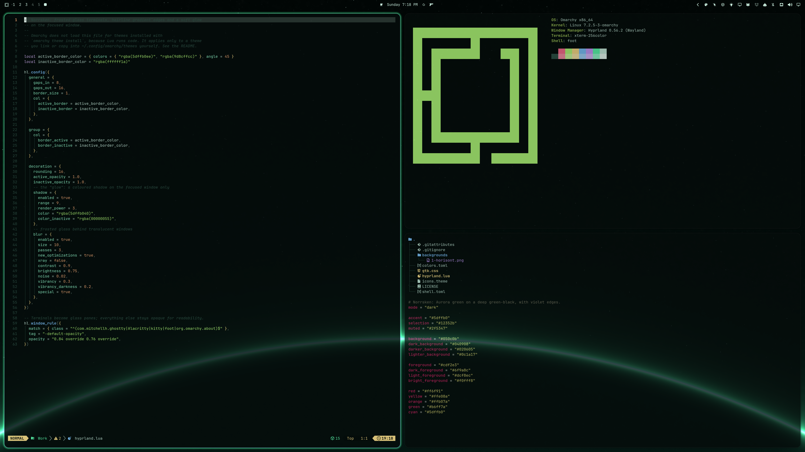
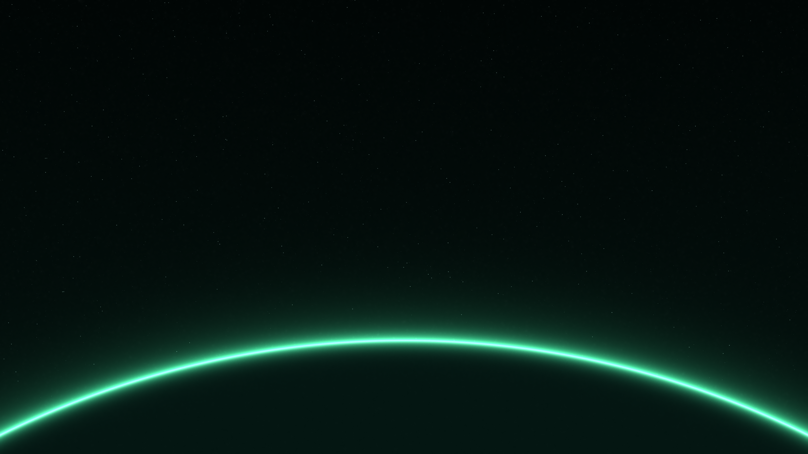

# Norrsken

An Omarchy theme in aurora green on a deep green-black, with violet-edged windows, a translucent glass shell, and a glowing planet horizon.



Neovim, fastfetch, and a terminal listing using Norrsken with the full glass effect.

## Background

One **3840 × 2160** background: a thin aurora-green planet edge against a star field with crisp pinpoint stars.

[](backgrounds/1-horisont.png)

## Install

```bash
omarchy theme install https://github.com/ejuro/omarchy-norrsken-theme.git
```

Tested on Omarchy **4.0.4**. Requires support for `colors.toml` and `shell.toml` theme overrides. The icon theme is `Yaru-prussiangreen`.

This installs the palette, the green-to-violet window borders, the translucent bar, menus, launcher, notifications, and lock screen, the GTK styling, and the background.

### Full glass effect (optional)

The frosted-glass terminals, blur, rounded corners, and soft glow around the focused window live in `hyprland.lua`. Omarchy does not load Lua from themes installed with `omarchy theme install`, because Lua runs code, so that command leaves these effects out.

To use them, read `hyprland.lua` first, then clone the repository and link it in place of the installed copy:

```bash
git clone https://github.com/ejuro/omarchy-norrsken-theme.git
cd omarchy-norrsken-theme
rm -rf ~/.config/omarchy/themes/norrsken
ln -s "$(pwd)" ~/.config/omarchy/themes/norrsken
omarchy theme set norrsken
```

Keep the source folder in place: the installed theme links to it.

Terminals, the Omarchy About window, [Omawrite](https://github.com/ejuro/omawrite), and [Flea](https://github.com/ejuro/flea) turn to glass; other windows stay opaque for readability. To add an application, put its window class (from `hyprctl clients`) in the `match` line of `hyprland.lua` and run `omarchy theme set norrsken` again. The glow size is `range` under `shadow`.

## GTK styling

To apply the bundled styling to GTK applications, link their user stylesheet to the current Omarchy theme. The following backs up any existing CSS first:

```bash
for version in 3.0 4.0; do
  directory="$HOME/.config/gtk-$version"
  mkdir -p "$directory"
  if [ -e "$directory/gtk.css" ] || [ -L "$directory/gtk.css" ]; then
    mv "$directory/gtk.css" "$directory/gtk.css.backup.$(date +%s)"
  fi
  ln -s "$HOME/.local/state/omarchy/current/theme/gtk.css" "$directory/gtk.css"
done
```

Reopen GTK applications afterward. These links follow theme changes. When a theme has no `gtk.css`, GTK falls back to its default styling.

## Palette

| Role | Color |
| --- | --- |
| Main surfaces | `#050c0b` |
| Raised surfaces | `#0c1a17` |
| Text | `#cdf2e3` |
| Accent | `#5dffb0` |
| Border gradient | `#5dffb0` → `#9d8cff` |
| Selection | `#12352b` |
| Muted text | `#6f9a8c` |

## Customization and compatibility

`colors.toml` supplies the shared palette and the border gradient. Omarchy generates terminal and supported application configurations from it. `shell.toml` styles the shell surfaces as translucent glass, `gtk.css` styles GTK applications, and `hyprland.lua` adds the optional glass effect. Update those files too when changing palette colors, then reapply the theme.

Norrsken contains no application patches or install hooks.

## License

[MIT](LICENSE). Copyright (c) 2026 Erik Johansson.

Attribution for adapted upstream portions is recorded separately in [third-party notices](THIRD_PARTY_NOTICES.md).
